# SALT-YASTF: Consolidated Call Chain Analysis

## Complete Pipeline Flow

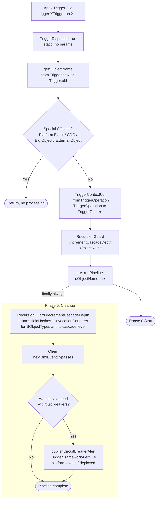

## Phase 0: Handler Loading and Pre-Processing

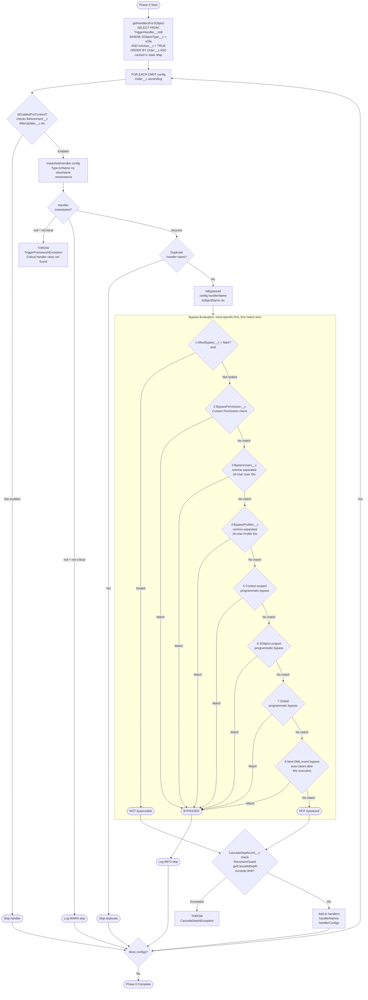

## Phase 1: Record Filtering via IRecordFilter

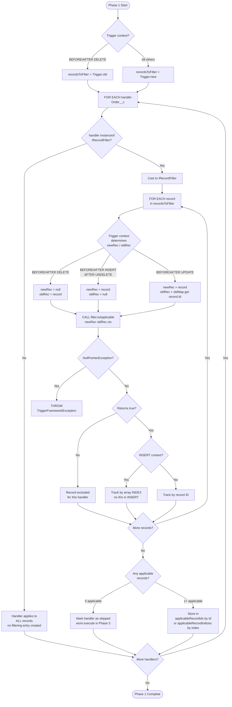

### Built-in IRecordFilter Implementations

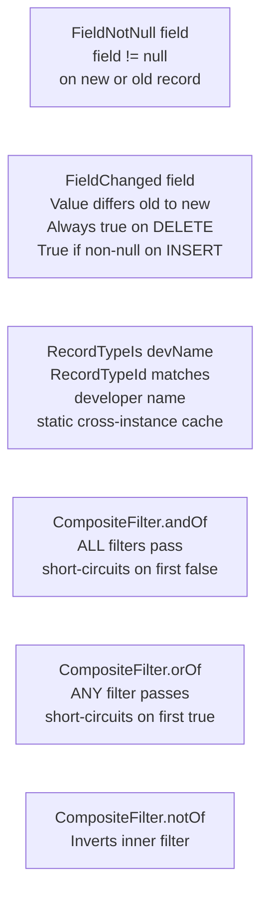

## Phase 2: Query Declaration, Aggregation, Execution via IQueryAware

```mermaid
flowchart TD
    P2_START(["Phase 2 Start"])

    P2_START --> P2_LOOP["FOR EACH non-skipped handler"]
    P2_LOOP --> IS_QA{"handler instanceof\nIQueryAware?"}
    IS_QA -- No --> P2_STD["Standard handler\nno query needs"]
    IS_QA -- Yes --> QA_CAST["Cast to IQueryAware"]

    QA_CAST --> QA_GET_RECS["getApplicableRecords\nrespects Phase 1 filtering"]
    QA_GET_RECS --> QA_DECLARE["CALL queryAware.declareQueryNeeds\napplicableRecords oldMap"]
    QA_DECLARE --> QA_RETURNS["Returns List of QueryRequest\n(may carry Predicate filter tree,\nChildSubqueryDescriptor,\nper-handler tag)"]
    QA_RETURNS --> QA_AGG["QueryAggregator.addRequests"]
    QA_RETURNS --> QA_CACHE["Cache applicable records\nfor Phase 3 reuse F-QB10"]

    P2_STD & QA_AGG & QA_CACHE --> P2_MORE{"More handlers?"}
    P2_MORE -- Yes --> P2_LOOP
    P2_MORE -- No --> MERGE

    MERGE["QueryAggregator.getMergedRequests"]
    MERGE --> MERGE_GROUP["Group by merge key\nSObjectType + RelationshipField"]
    MERGE_GROUP --> MERGE_GATE{"canMergeOrUnion(a, b)\nsingle merge gate"}
    MERGE_GATE -- "REFUSE\n(FLS mismatch / shape mismatch /\ntag collision / mixed null tags)" --> MERGE_SEP
    MERGE_GATE -- "MERGE_IDENTITY\n(structurally equal\nPredicate trees)" --> MERGE_DO
    MERGE_GATE -- "MERGE_OR\n(different non-empty\npredicate trees,\notherwise compatible)" --> MERGE_OR_DO
    MERGE_GATE -- "MERGE_SUBSUME\n(one side empty filters,\nother has filters)" --> MERGE_SUB
    MERGE_DO["Union ids + fields\nNo OR rendering\nwasOrMerged = false"]
    MERGE_OR_DO["Union ids + fields\nUNION FIELD SETS\nRender predicate clause as\n((handlerA-AND-chain) OR\n (handlerB-AND-chain))\nwasOrMerged = true"]
    MERGE_SUB["Take empty-filter side as base\nFiltered side's predicates stored\nin filtersByHandler for matcher\nwasOrMerged = true"]
    MERGE_SEP["Separate QueryRequests"]
    MERGE_DO & MERGE_OR_DO & MERGE_SUB & MERGE_SEP --> CB_SOQL

    CB_SOQL{"SOQL Circuit Breaker\nBudget = getLimitQueries\n- soqlReserve\n- cascadeDepth x perLevel\nMerged count fits?"}
    CB_SOQL -- Yes --> CB_HEAP
    CB_SOQL -- No --> CB_SOQL_P1["Pass 1: Drop ALL\nnon-critical IQueryAware\nhandlers from merged set"]
    CB_SOQL_P1 --> CB_SOQL_P2{"Pass 2: Critical\nqueries fit now?"}
    CB_SOQL_P2 -- Yes --> CB_HEAP
    CB_SOQL_P2 -- No --> THROW_SOQL["THROW\nSoqlBudgetException"]

    CB_HEAP{"Heap Circuit Breaker\nThreshold = getLimitHeapSize\nx 0.75 default\nUnder threshold?"}
    CB_HEAP -- Yes --> QE_START
    CB_HEAP -- No --> CB_HEAP_P1["Pass 1: Drop ALL\nnon-critical IQueryAware\nhandlers"]
    CB_HEAP_P1 --> CB_HEAP_P2{"Pass 2: Critical\nqueries under\nheap threshold?"}
    CB_HEAP_P2 -- Yes --> QE_START
    CB_HEAP_P2 -- No --> THROW_HEAP["THROW\nTriggerFrameworkException"]
```

### Query Execution

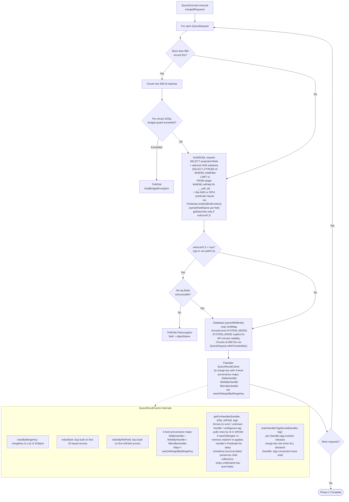

## Phase 3: Handler Execution

```mermaid
flowchart TD
    P3_START(["Phase 3 Start"])

    P3_START --> CREATE_REG["Create DmlRegistrar\nnew instance per pipeline"]
    CREATE_REG --> SET_CTX["registrar.setBeforeTriggerContext\nisBefore"]
    SET_CTX --> SET_MAP{"isBefore AND\nTrigger.newMap != null?"}
    SET_MAP -- Yes --> SET_NEWMAP["registrar.setTriggerNewMap\nTrigger.newMap"]
    SET_MAP -- No --> P3_LOOP
    SET_NEWMAP --> P3_LOOP

    P3_LOOP["FOR EACH handler\nOrder__c"]

    P3_LOOP --> SKIP_P1{"In skippedHandlers?\nPhase 1: 0 applicable"}
    SKIP_P1 -- Yes --> P3_SKIP_LOG1(["Log INFO skip"])
    SKIP_P1 -- No --> SKIP_P2{"In querySkippedHandlers?\nPhase 2: circuit breaker"}
    SKIP_P2 -- Yes --> P3_SKIP_LOG2(["Log INFO skip"])
    SKIP_P2 -- No --> REENTRY_CHECK

    REENTRY_CHECK{"INSERT context AND\nMaxReentrancy__c > 0?"}
    REENTRY_CHECK -- No --> RECURSION_CHECK
    REENTRY_CHECK -- Yes --> REENTRY_EXCEEDED{"RecursionGuard\n.isInvocationLimitExceeded?"}
    REENTRY_EXCEEDED -- No --> RECURSION_CHECK
    REENTRY_EXCEEDED -- Yes --> REENTRY_CRIT{"IsCritical__c?"}
    REENTRY_CRIT -- Yes --> THROW_REENTRY["THROW\nRecursionLimitException"]
    REENTRY_CRIT -- No --> P3_SKIP_SILENT(["Silently skip"])

    RECURSION_CHECK{"handler instanceof\nIRecursionAware\nAND NOT BEFORE_INSERT?"}
    RECURSION_CHECK -- No --> CPU_CHECK
    RECURSION_CHECK -- Yes --> REC_CAST["Cast to IRecursionAware"]
    REC_CAST --> REC_FIELDS["CALL recursionAware\n.getRecursionFields\nreturns List of SObjectField"]
    REC_FIELDS --> REC_VALIDATE{"All fields belong\nto trigger SObject\nschema?"}
    REC_VALIDATE -- No --> THROW_FIELD_VAL["THROW\nTriggerFrameworkException\nfield does not belong to SObject"]
    REC_VALIDATE -- Yes --> REC_HASH_LOOP["FOR EACH record"]

    REC_HASH_LOOP --> REC_COMPUTE["RecursionGuard.computeFieldHash\nrecord recursionFields\nlength-prefixed field values"]
    REC_COMPUTE --> REC_CHECK{"hasBeenProcessed\nWithSameFields?"}
    REC_CHECK -- Yes --> REC_SKIP_REC["Record SKIPPED\nalready processed\nwith same field values"]
    REC_CHECK -- No --> REC_COLLECT["Collect as unprocessed\nStore pendingHash\nF48: deferred marking"]

    REC_SKIP_REC & REC_COLLECT --> REC_MORE{"More records?"}
    REC_MORE -- Yes --> REC_HASH_LOOP
    REC_MORE -- No --> REC_EMPTY{"All records\nalready processed?"}
    REC_EMPTY -- Yes --> P3_SKIP_REC_ALL(["Skip handler entirely"])
    REC_EMPTY -- No --> REC_NARROW["Narrow applicableRecordIds\nto unprocessed only\nInvalidate Phase 2 cache L2-1"]
    REC_NARROW --> CPU_CHECK

    CPU_CHECK{"CPU Circuit Breaker\ngetCpuTime exceeds\nthreshold fraction?"}
    CPU_CHECK -- No --> SET_HANDLER
    CPU_CHECK -- Yes --> CPU_CRIT{"Non-critical AND\nafter-trigger?"}
    CPU_CRIT -- Yes --> P3_CPU_SKIP(["Skip handler\nCPU circuit breaker"])
    CPU_CRIT -- No --> CPU_WARN["Log WARN proceed\ncritical or before-trigger"]
    CPU_WARN --> SET_HANDLER

    SET_HANDLER["registrar.setCurrentHandler\nhandlerName"]
    SET_HANDLER --> EXEC_PATH(["To executeHandler"])
```

## Phase 3 cont: executeHandler Dispatch Logic

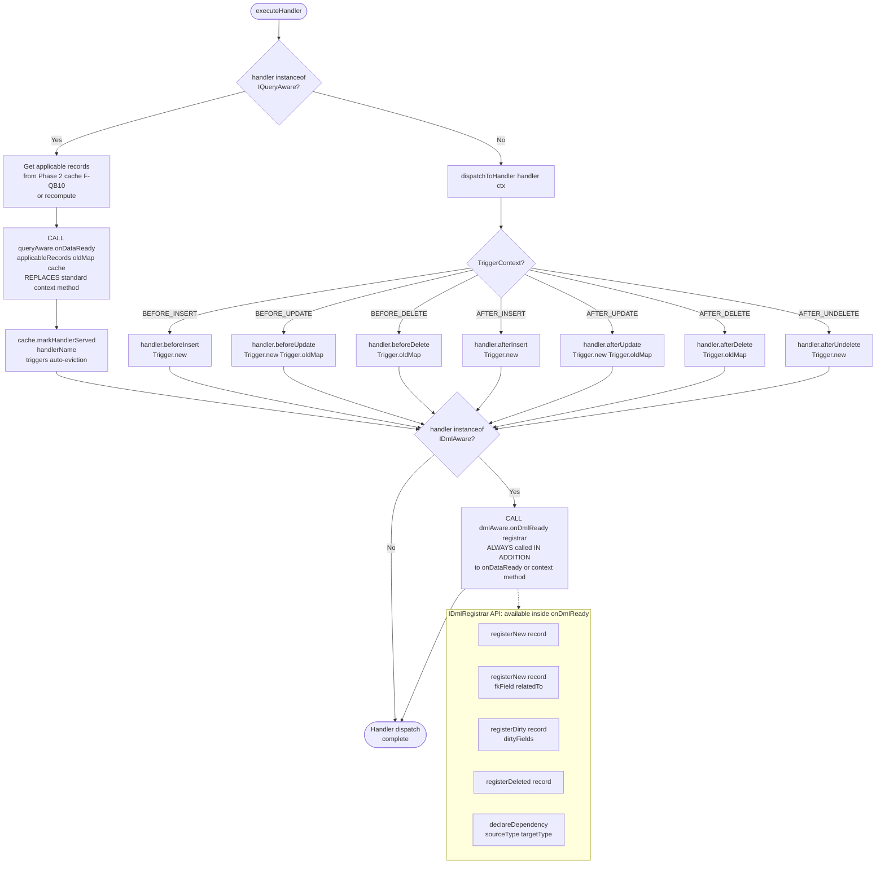

## Phase 3 cont: Exception Handling Per Context

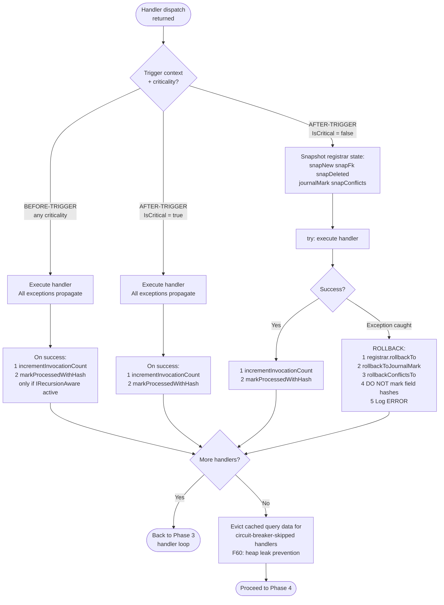

## Phase 4: DML Commit, After-Trigger Only

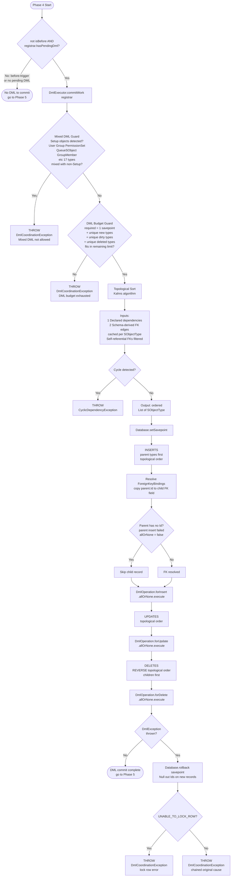

## Cascade Re-Entry Flow

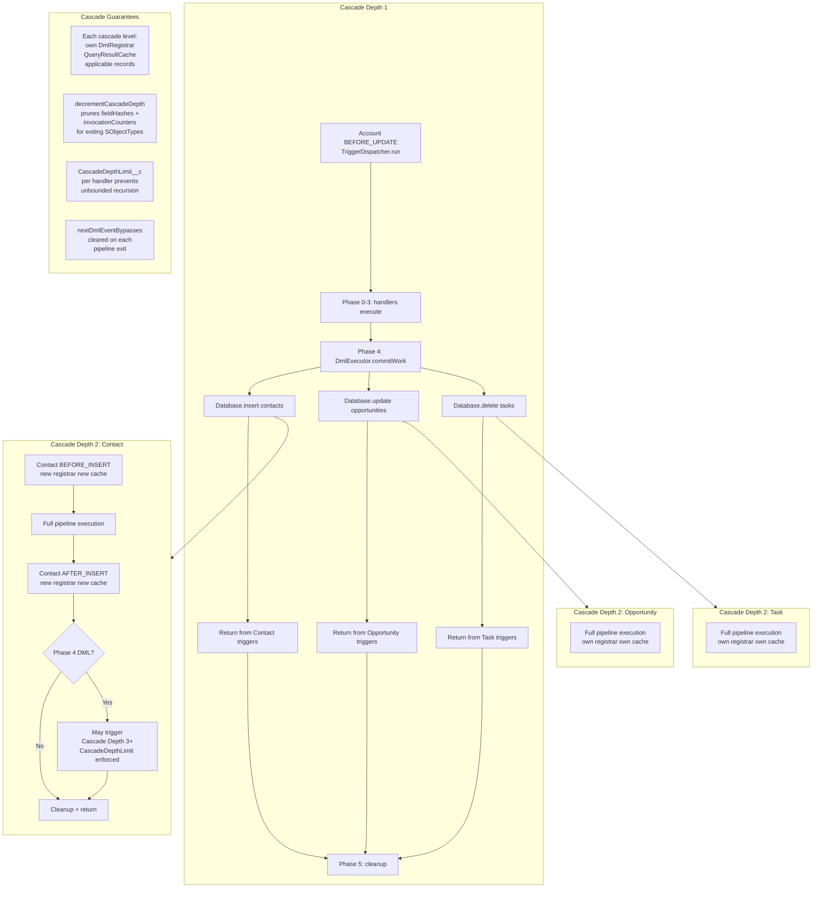

## DmlRegistrar State Flow Per Context

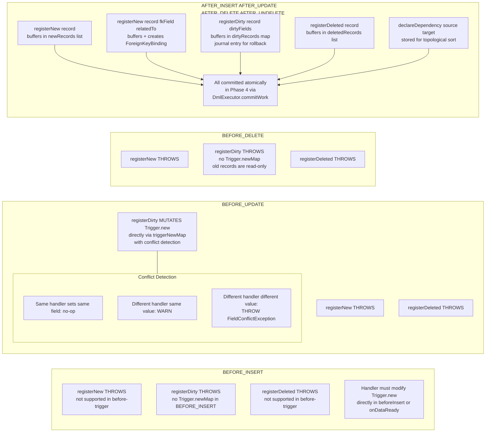

## Context x Interface Compatibility Matrix

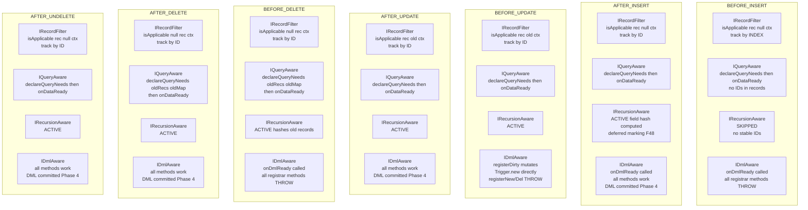

## Exception Propagation Map

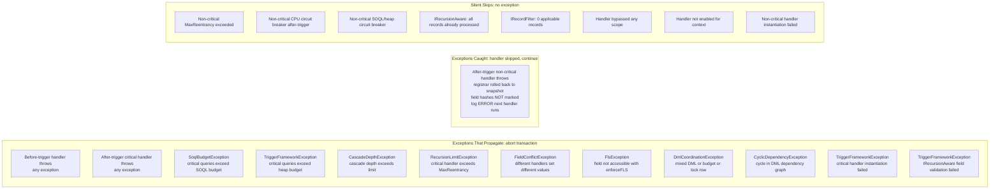
